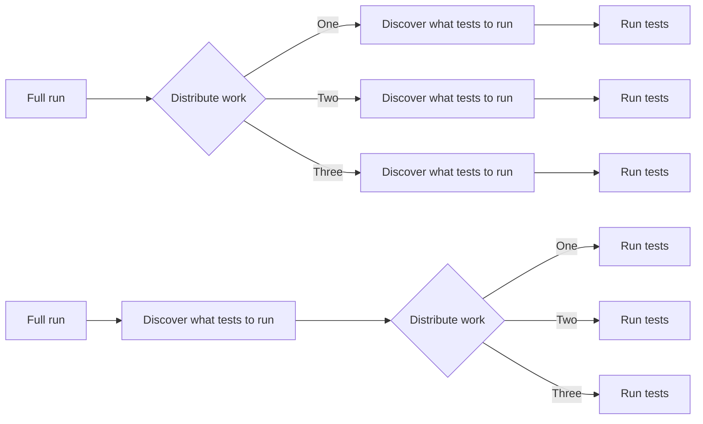

We got a taste for speed after [UV gave us back 215 compute hours a month](2024-04-03-build-images-with-uv.md). 
Our CI workflow gets triggered on each commit, and due to the high volume of contributions, it was triggered 6647 times in March 2024.
The full runs, where the whole test suite is being executed, take a long time.

It turned out that the plugin, we used to split the tests into 10 groups, was inefficient. Each pytest job needed to discover all tests, even when the job intended to only execute a subset of them.

Now we have a separate job to discover all tests and split them into 10 groups. The 10 pytest jobs only need to execute a subset of all tests. Not doing full-discovery in each test runner saves us 3 hours on each full run!

A short analysis of the 6647 CI workflows in March 2024 revealed the following stats:
- 2406 were canceled before termination
    - 1771 should be full runs
- 1085 failed
    - 732 where failed full runs
- 3007 terminated successfully
    - 1629 partial runs (only tests for a given integration where executed)
    - 1378 full runs

Considering the 1378 successful full runs, we would have saved around **4042 hours ~ 168 days** of execution time in March 2024 with [#114381](https://github.com/home-assistant/core/pull/114381). Even more, if I had also analyzed the failed/canceled ones.

The more than 168 monthly saved execution days can be used by other jobs and make the CI experience for all developers and our community better.
We improved our sustainability by using fewer resources to run our test suite.

**A big thank you to GitHub for providing Home Assistant with additional CI runners.**
