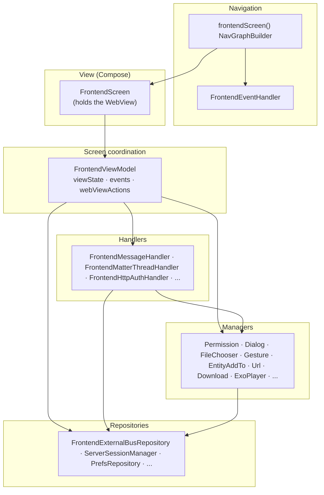
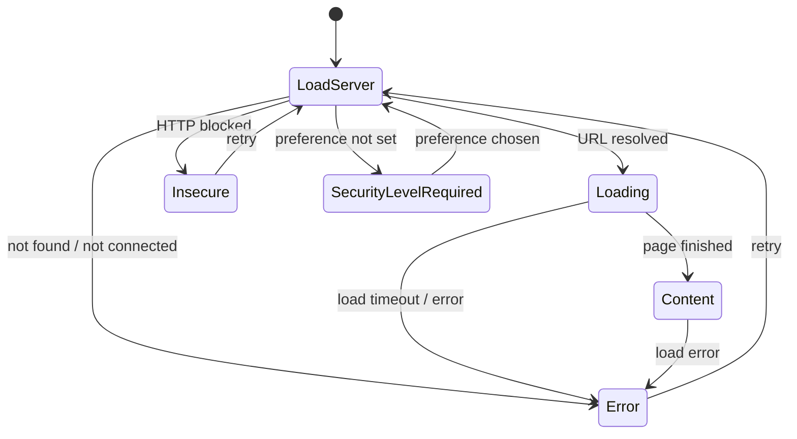
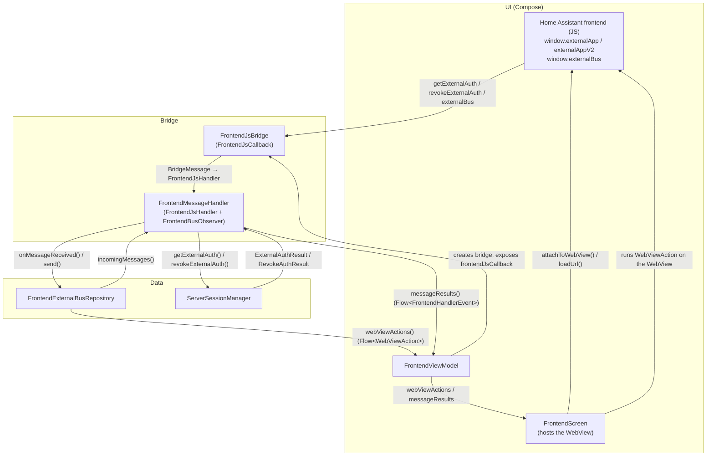

The Frontend screen is the reference implementation of the [UI architecture](/docs/android/architecture/ui_architecture) and the most complex screen in the app. It renders the Home Assistant frontend inside a [WebView](https://developer.android.com/reference/android/webkit/WebView), wrapped with native capabilities (authentication, gestures, downloads, NFC, Matter/Thread, media playback, ...). Its inputs (the user, the WebView, the [external bus](/docs/frontend/external-bus), system callbacks, timeouts) are exactly the "many concurrent sources" the pattern is for. The code lives in the [`frontend/`](https://github.com/home-assistant/android/tree/main/app/src/main/kotlin/io/homeassistant/companion/android/frontend) package.

The dependency graph follows the pattern's layers. At runtime, results flow back up through the flows each layer exposes: managers push pending state the screen renders, handlers push results the ViewModel reduces, and repositories emit typed messages the handlers consume.



## At a glance

| Pattern role | Frontend implementation |
|---|---|
| Navigation + event consumption | `frontendScreen()`, `FrontendEventHandler` |
| View | `FrontendScreen` / `FrontendScreenContent` |
| ViewModel | `FrontendViewModel` |
| State | `FrontendViewState` |
| Events | `FrontendEvent` |
| Actions | `WebViewAction` |
| Prompts | `SingleSlotQueue` with `FrontendDialog`, `PermissionRequest`, `FileChooserRequest` |
| Handlers | `FrontendMessageHandler`, `FrontendMatterThreadHandler`, `FrontendHttpAuthHandler`, ... |
| Managers | `PermissionManager`, `FrontendDialogManager`, `FileChooserManager`, `FrontendUrlManager`, `FrontendDownloadManager`, `FrontendExoPlayerManager`, `FrontendGestureManager`, `FrontendEntityAddToManager`, ... |
| Repositories | `FrontendExternalBusRepository`, `ServerSessionManager` |

## State lifecycle and overlays

The `FrontendScreen` always renders the WebView at the base layer, then draws one overlay on top, chosen by the current `FrontendViewState` (a `when` over the sealed state). The WebView stays mounted underneath so it keeps its loaded page across overlay changes.

| `FrontendViewState` | Overlay on top of the WebView |
|---|---|
| `LoadServer`, `Loading` | Loading indicator |
| `Content` | None, the WebView shows through |
| `SecurityLevelRequired` | Security-level configuration screen |
| `Insecure` | "Insecure connection" block screen |
| `Error` | Connection-error screen |

The ViewModel reduces URL resolution, page-load callbacks, timeouts, and user retries into the transitions between those states:



`LoadServer` is the entry point (it also blanks the WebView while the next URL is resolved). Switching servers re-enters `LoadServer` from any state with the new server id. One terminal case: an `Error` carrying a `FrontendConnectionError.UnrecoverableError` (for example, the system WebView failing to initialize) can't be retried, and the ViewModel ignores any further transition out of it.

## Error handling

The connection-error UI is shared with onboarding, so it can't depend on `FrontendViewModel`. Instead it depends on a narrow capability interface, `FrontendConnectionErrorStateProvider`, exposing only what the error screen needs:

```kotlin
interface FrontendConnectionErrorStateProvider {
    val urlFlow: StateFlow<String?>
    val errorFlow: StateFlow<FrontendConnectionError?>
    val connectivityCheckState: StateFlow<ConnectivityCheckState>
    fun runConnectivityChecks()
}
```

`FrontendConnectionErrorScreen` is written against this interface, and `FrontendViewModel` implements it, so the error overlay receives the ViewModel directly as its provider. A `FrontendConnectionErrorStateProvider.noOp` drives previews and tests.

This is the general technique for reusing UI or logic across screens without coupling it to a concrete ViewModel: define a small interface for exactly what the reusable piece needs, and have each ViewModel implement it. The dependency then points at the interface, not at any one ViewModel.

## The WebView

`FrontendScreen` mounts the WebView through the reusable `HAWebView` composable, which creates the platform `WebView` inside an `AndroidView`, applies baseline settings, routes the back button to the WebView's history before the nav host, shows a placeholder under previews and screenshot tests, and reports a creation failure (which the ViewModel turns into an unrecoverable `Error` state). `FrontendScreen` then layers the frontend-specific configuration on top: it attaches the two clients below, and wires cookies, downloads, and the gesture listener.

Both clients are created by the ViewModel:

- `HAWebViewClient` is built by `HAWebViewClientFactory`. It owns TLS client-certificate auth, maps load/SSL errors to `FrontendConnectionError`, reports page-finished, surfaces HTTP Basic-auth challenges, and recovers from a render-process crash.
- `HAWebChromeClient` is built by `viewModel.createWebChromeClient(...)`. It handles runtime permission requests (camera/mic), JavaScript `confirm()` dialogs, the file chooser, and the fullscreen custom-view hand-off.

:::note A deliberate exception
The ViewModel normally references no platform UI types. The WebView clients are the one accepted exception: they have to be wired to ViewModel logic (error mapping, page-load callbacks, HTTP auth, permissions), so the ViewModel builds and owns them. This doesn't cost unit testability: the client comes from a factory a test can fake, and the chrome client is built only when the screen asks for it, so the ViewModel's reduction logic still runs as a plain JVM unit test.
:::

## Frontend ↔ native communication

The frontend (JavaScript) and native code talk over a JavaScript bridge. This is what powers [external authentication](/docs/frontend/external-authentication) and [external bus](/docs/frontend/external-bus) messaging. The `FrontendScreen` is the only WebView holder; everything below it stays UI-free and communicates through `Flow`s.



`FrontendJsBridge` is the JavaScript interface registered into the WebView. It receives raw calls from the frontend, parses them into typed `BridgeMessage` variants, and dispatches them to `FrontendMessageHandler`. `FrontendExternalBusRepository` owns the typed, bidirectional bus channel: incoming JSON is deserialized into `IncomingExternalBusMessage` (with forward-compatible handling of unknown types), and outgoing `OutgoingExternalBusMessage`s are serialized into queued `WebViewAction.EvaluateScript`.

The message flow is decoupled from the WebView through `Flow`s. The ViewModel and lower layers never call WebView APIs directly; they emit `WebViewAction`s that only the `FrontendScreen` runs:

- Inbound (frontend → native): the frontend calls the bridge (`externalBus`) → `FrontendJsBridge` parses a `BridgeMessage` and dispatches it → `FrontendMessageHandler` hands it to `FrontendExternalBusRepository.onMessageReceived()` → the repository deserializes and emits on `incomingMessages()` → the handler maps it to a `FrontendHandlerEvent` via `messageResults()` → the ViewModel reduces it into state, an event, or an action.
- Outbound (native → frontend): a component calls `FrontendExternalBusRepository.send()` with a typed `OutgoingExternalBusMessage` → it is serialized into an `externalBus(...)` script wrapped in `WebViewAction.EvaluateScript` → surfaces through `webViewActions()` → the `FrontendScreen` evaluates it in the WebView, invoking `window.externalBus`.
- Authentication (a separate channel): the frontend calls `getExternalAuth`/`revokeExternalAuth` → the handler asks `ServerSessionManager` → the resulting callback script is evaluated in the WebView, invoking the validated frontend callback (`externalAuthSetToken`/`externalAuthRevokeToken`).

The action and event flows are buffered `SharedFlow`s, so commands aren't dropped while the WebView is momentarily unavailable.

`FrontendJsBridge` registers one of two protocols depending on the server version:

- V1 (`window.externalApp`): the legacy protocol via [`WebView.addJavascriptInterface`](https://developer.android.com/reference/android/webkit/WebView#addJavascriptInterface(java.lang.Object,%20java.lang.String)); the frontend calls named methods directly.
- V2 (`window.externalAppV2`): introduced in Home Assistant 2026.4.2 via [`WebViewCompat.addWebMessageListener`](https://developer.android.com/reference/androidx/webkit/WebViewCompat); all messages go through `postMessage` as a JSON envelope with a `type` discriminator, with origin and iframe filtering for security.

The app picks V2 when the server supports it and the device's WebView supports the [`WEB_MESSAGE_LISTENER`](https://developer.android.com/reference/androidx/webkit/WebViewFeature#WEB_MESSAGE_LISTENER) feature, otherwise it falls back to V1.

## Dependency injection and scoping

Per-session blocks are `@ViewModelScoped`, so each `FrontendViewModel` gets fresh instances and every consumer within one screen session shares them. This includes `FrontendExternalBusRepository`: the bus only exists for a screen's WebView, so scoping it to the session prevents buffered messages from one visit leaking into the next. `FrontendHandlerModule` binds `FrontendMessageHandler` to both `FrontendJsHandler` and `FrontendBusObserver` in the `ViewModelComponent`.

## Testing the frontend screen

| Layer | Test type | Focus |
|---|---|---|
| `FrontendViewModel` | Unit (JUnit5 + Turbine) | Reduction logic: which input produces which state / event / action. |
| Managers and handlers | Unit | Each concern in isolation; assert the returned sealed result or emitted pending state. |
| `FrontendScreenContent` | Compose UI | Rendering per state and that interactions invoke the right callback. |
| `FrontendEventHandler` | Compose UI | Emitting each `FrontendEvent` invokes the right host callback (navigate, snackbar, ...). |
| `FrontendScreen` | Screenshot | Visual regression only (no logic). |
