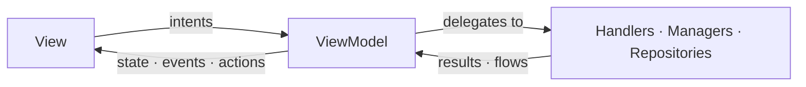
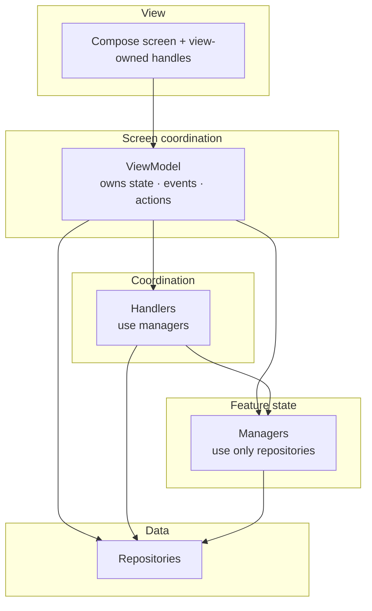
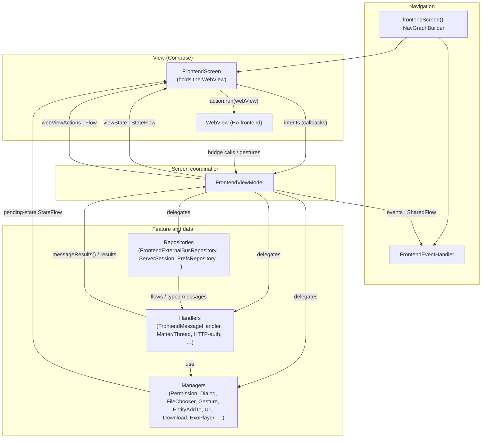
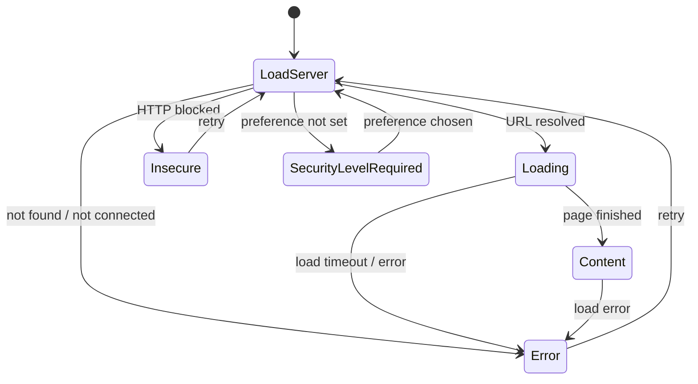
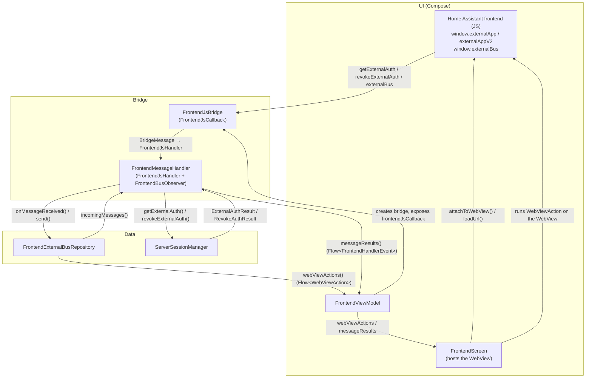

This page describes the **MVI‑like** pattern we use for screens, and then shows how the dashboard (the frontend screen) applies it. New UI should follow the same pattern.

## The pattern

A screen often has many concurrent input sources — the user, system callbacks (permissions, file chooser), timers, and external channels — that all have to be reduced into **one** coherent UI. The pattern keeps that predictable and testable: all inputs flow _in_ as intents, and are turned into a few well‑defined outputs — durable **state**, one‑shot **events**, and imperative **actions**.

Above all it's about **maintainability**. The Home Assistant Companion app has many features, and a single screen can pull in a lot of them; without structure that breeds "god" objects — a screen class or ViewModel that knows everything and can't be tested or changed safely. The pattern pushes the other way: each concern lives in its own small, single‑responsibility block (see [Building blocks](#building-blocks)), so a screen stays easy to work with as it grows.

### Unidirectional data flow

Intents (user actions, callbacks, external messages, system results) go _down_ into the **ViewModel**, which delegates to specialized blocks and **reduces** their outputs into the channels that flow back _up_:

- a single **state** — what to render;
- one‑shot **events** — navigation and other fire‑and‑forget side effects;
- **actions** — imperative commands for a view‑owned handle the ViewModel can't hold.

A given intent produces only the outputs it needs — often just state, sometimes none. Actions are situational: only screens that drive a view‑owned object emit them. They, and **prompts** that wait for the user's answer (a dialog, a permission, a file picker), are detailed under [Reaching the view beyond state](#reaching-the-view-beyond-state).



### Building blocks

Each block has a single responsibility and a defined way of talking to its neighbours.

#### View

The Compose screen. It renders **purely from the current state**, holds any non‑portable UI handles the lower layers must not touch (a `WebView`, a list's scroll state, …), drains the **action queue** and runs each action against those handles, observes any **pending‑state** the managers expose, and sends user intents back to the ViewModel through callbacks. Split it into a stateful entry point and a stateless content composable so previews and Compose tests can drive it directly.

#### ViewModel — the screen coordinator

Owns the screen's output channels (state, events, and — when it drives a view‑owned object — actions) and wires the blocks below together: it _reduces_ every input into a new state, a one‑shot event, or a queued action. It must never reference Compose or platform‑UI types, so it stays unit‑testable.

It also **outlives configuration changes**: its `viewModelScope` is canceled only when the screen is permanently gone, not on rotation or recomposition. Long‑running work — loading, in‑flight requests, flow collection — runs in that scope (or in a block scoped to it), so a rotation doesn't cancel and restart it.

**Keep it thin.** A small screen's ViewModel can hold its feature logic directly. As it grows, extract cohesive logic _down_ into managers and handlers rather than letting the ViewModel become a monster that mixes unrelated concerns — its own job is coordination (owning the channels, routing inputs), not every feature's internals.

A typical shape:

```kotlin
val state: StateFlow<UiState>     // what to render
val events: SharedFlow<UiEvent>   // one-shot side effects
val actions: Flow<UiAction>       // imperative commands for the view
```

#### State

The **persistent** UI state — the single source of truth for what is rendered. It **must be kept immutable** — the language won't enforce this, so treat it as a design rule: use `val` properties and immutable collections, and produce a _new_ instance (via `copy()`) for each change rather than mutating in place. (In‑place mutation breaks change detection and the unidirectional flow.) It survives recomposition and configuration changes, and persists until an intent or system event triggers a transition. Re‑emitting the same state must be a no‑op (idempotent).

Shape it to the screen:

- a single **data class** when the screen always has the same shape and only its fields change;
- a **sealed** hierarchy when the screen has genuinely distinct modes (loading, content, error, …). The compiler then enforces exhaustive handling and keeps one mode's logic from mixing with another's, instead of one flat model with nullable/boolean flags that can express impossible combinations.

#### Events

A sealed interface of **one‑shot, fire‑and‑forget** effects (navigate, show a snackbar, open a link, …). Emitted on a `Flow` and consumed exactly once by a dedicated event handler — most often in the **navigation layer**, which holds the navigation controller and host callbacks, so navigation and other host‑level effects land there naturally. They must **not** be persisted or replayed.

#### Reaching the view beyond state

Two mechanisms let the ViewModel get the view to do something it can't do itself, each able to hand a result back through a `CompletableDeferred`. They look alike but sit on **opposite primitives**, by design — an action is a _consumed‑once stream_; a prompt is a _single rendered pending‑state_. That difference is the whole point, and it's why they stay separate.

##### Actions

Some imperative objects _must_ live in the **view** — a `WebView`, a `LazyListState`, a focus requester — because the UI framework creates them inside the composition. The ViewModel must **not** hold a reference to one: that would tie it to platform‑UI types and the view's lifecycle, and break its unit‑testability. Yet some operations on them are genuinely imperative ("reload now", "scroll to top", "evaluate this script") and can't be expressed as declarative state.

The **action queue** resolves that tension: the ViewModel emits a typed action onto a `Flow`, and the view collects it and runs it against the handle _it_ owns — commanding the object without ever holding it. An _awaitable_ variant carries a `CompletableDeferred` so the caller can await a result (for example, a script's return value).

The flow is a **consumed‑once `SharedFlow`** (buffered, so commands aren't dropped while the view is momentarily unavailable) — deliberately _not_ pending‑state. A command held as state would re‑run on every recomposition or re‑subscription ("reload" firing again and again); consuming it once is what makes "do this now" safe. This is also why an action is **not** an event: an event is a fire‑and‑forget signal the _host_ reacts to (navigate, snackbar), whereas an action drives a specific object _this screen owns_.

**Reserve it for objects that must live in the view.** Anything a lower layer _can_ own should be owned there instead: a **media player**, for example, is held by a manager and surfaced through **state** — no action queue involved. In practice a screen has at most one such handle, often none. Each action type runs against one specific handle (its `run()` takes that object), so the rare screen with two view‑only objects would define a separate action type for each.

##### Request/response prompts

For interactions that must show UI and **wait for the user's answer** — a dialog, a permission prompt, a file picker — use the single‑slot request/response queue (`common/util/SingleSlotQueue.kt`). It serializes prompts where only one can be on screen at a time: it exposes the current request as a pending‑state `StateFlow<T?>`, and `awaitResult { onResult -> … }` enqueues a request, suspends until the UI invokes `onResult`, then frees the slot. Concurrent requests are served in arrival order, and a canceled caller is removed cleanly.

Unlike an action, this **isn't a ViewModel output channel** — it composes a rendered pending‑state (a `StateFlow`) with the answer arriving as an input, and `awaitResult` just collapses that round‑trip into one suspending call. It is the one spot that isn't strictly one‑way, a deliberate trade of one‑way‑flow purity for ergonomics.

#### Handlers

A **handler** is logic pulled out of the ViewModel that **uses one or more managers**. It's where coordination lives — the ViewModel should stay thin, and a manager may never depend on another manager. A handler can be a one‑shot translator (mapping one input to a typed result) or a multi‑step flow that drives several managers across an async round‑trip; it may be stateless or hold transient flow state. None of that is what defines it — **depending on a manager is.**

It hands its work back to the ViewModel as a sealed result (pull) or a flow of results/events (push). It may keep its **own** feature‑scoped state, which the ViewModel maps into the screen `viewState` — but the screen's single `viewState` always belongs to the ViewModel, never the handler.

#### Managers

A manager **owns the logic of exactly one feature concern, depending only on repositories** (and platform APIs) — never on another manager. If it would need one, that coordination is a [handler](#handlers)'s job, not a manager's. It may hold the feature's in‑memory state. Its lifetime is a [scoping](#scoping) choice, not part of the definition — it may be scoped to a single screen or shared app‑wide. It talks to the ViewModel in one (or more) of three ways:

- **Push pending state** — expose a `StateFlow<T?>` the view observes and renders.
- **Pull a result** — a `suspend` function returning a sealed result the ViewModel handles.
- **Pull a stream** — a `Flow` of results the ViewModel collects.

#### Repositories

A repository is the **single source of truth for a data source or communication channel**, abstracting where the data lives (storage, network, an external channel). It has no UI concerns.

### Layers and the dependency rule

The blocks form layers, and **dependencies point downward only**, so the graph is acyclic by construction — there can be no dependency cycles:



Every edge points **down**. At runtime, data flows back _up_ as state, events, and actions through the flows each layer exposes.

- **One rule decides the layer.** A **manager** depends only on repositories (and platform APIs); a **handler** is anything that depends on a manager. A manager that would need another manager is, by that definition, a handler — so `manager → manager` simply can't occur.
- **Downward only.** Handlers depend on managers and repositories; managers depend on repositories. No `handler → handler` (coordinate handlers in the ViewModel), and no up edges (a manager never depends on a handler).
- **The ViewModel can reach any layer directly.** When the logic is small it uses a manager or repository itself; it extracts a handler only once coordination across managers would otherwise bloat it (see [Keep it thin](#viewmodel--the-screen-coordinator)).

This keeps every block independently testable and prevents hidden cycles.

#### Scoping

Scope each block to how long its state must live. A block tied to one screen is `@ViewModelScoped` — **one shared instance per screen session**, so everything that injects it sees the same state, and that state resets when the session ends; a repository or manager that represents an app‑wide concern is most probably `@Singleton`. The shared‑instance part matters for any stateful block several places depend on (the ViewModel and a handler, say): an unscoped binding would give each its own copy.

:::note
Provide everything through Hilt — never instantiate these blocks manually.
:::

### Choosing an output

The most common decision. Ask what the output _is_, not where it is produced:

| If the output… | Use | Why |
|---|---|---|
| determines what is **rendered** and must survive recomposition/rotation | **state** | durable UI; re‑emitting the same value must be a no‑op |
| is a **one‑time** side effect that must fire exactly once and must not replay | **event** | replaying it (for example, on recomposition) would double‑navigate or double‑toast |
| is an imperative **command for a view‑owned handle** | **action** | the ViewModel stays UI‑free; only the view holds the handle |
| needs to **prompt the user and await a serialized response** | **request/response prompt** | one prompt at a time; the caller suspends until the user answers |

Rules of thumb:

- **Never** store one‑shot effects in state (a "navigate" boolean you must remember to reset is a smell — use an event).
- **Never** put durable UI in an event (it is lost on rotation — use state).
- If a value is needed back (a result, a yes/no), use an **awaitable** mechanism, not a fire‑and‑forget event.

### Choosing a building block

Work top‑down — the first row that matches wins:

| What you have | Pick | Deciding question |
|---|---|---|
| Access to a data source or a communication channel | **Repository** | "Single source of truth for some data/IO?" |
| One feature's concern, depending only on repositories | **Manager** | "Does it depend only on repositories?" |
| Logic that coordinates one or more managers | **Handler** | "Does it depend on a manager?" |
| Composing features and owning what's on screen | **ViewModel** | "Screen‑wide state or coordination?" |

**Repository vs manager.** A **repository** is the single source of truth for _one data source or communication channel_ (storage, network, the external bus) — data access only, no UI. A **manager** coordinates a feature: it holds the feature's in‑memory state and may draw on **several repositories** (and platform APIs) to do its job — reach for one especially when a feature prompts the user or holds a resource.

**Handler vs manager.** One question decides it: **does it depend on a manager?**

- **Yes → handler.** It coordinates one or more managers — a one‑shot router or a multi‑step flow — pulled out of the ViewModel to keep it thin.
- **No (only repositories) → manager.** It owns one feature's concern.

Don't reach for "stateless vs stateful" or "translates vs coordinates" — a handler can be either. The dependency is the whole test, and it's what keeps `manager → manager` impossible by construction.

What statefulness _does_ affect is **scope** — a stateful block must be scoped so its state has the right lifetime _and_ so every consumer shares one instance. If the ViewModel and a handler both depend on it, they must get the **same object**, or their views of the state diverge — an unscoped, per‑injection binding hands each consumer its own copy. See [Scoping](#scoping).

**Naming.**

- **`*Repository`** — single source of truth for data/IO.
- **`*Manager`** — one feature's concern, depending only on repositories; may expose pending UI state.
- **`*Handler`** — logic extracted from the ViewModel that coordinates one or more managers.

### Testing

The separation is what makes the screen testable:

| Layer | Test type | Focus |
|---|---|---|
| ViewModel | Unit | Reduction logic: which intent produces which state / event / action. |
| Managers and handlers | Unit | Each concern in isolation; assert the returned sealed result or emitted pending state. |
| Stateless screen content | Compose UI | Rendering per state, and that interactions invoke the right callback. |
| Event handler | Compose UI | Each event, when emitted, triggers the right navigation / side effect. |
| Screen | Screenshot | Visual regression only (no logic). |

That's by design, not a happy accident: the ViewModel and every block below it are kept free of Compose and platform‑UI types — which is _why_ they can run as ordinary JVM unit tests, with no platform‑UI or Compose runtime. For the project's conventions, see the [testing overview](/docs/android/testing/introduction), [unit tests](/docs/android/testing/unit_testing), and [screenshot tests](/docs/android/testing/screenshot_testing).

---

## The frontend screen

The dashboard is the reference implementation of this pattern and the most complex one. It renders the Home Assistant frontend inside a [WebView](https://developer.android.com/reference/android/webkit/WebView), wrapped with native capabilities (authentication, gestures, downloads, NFC, Matter/Thread, media playback, …). Its inputs — the user, the WebView, the [external bus](/docs/frontend/external-bus), system callbacks, timeouts — are exactly the "many concurrent sources" the pattern is for. The code lives in the `frontend/` package.



### At a glance

| Pattern role | Frontend implementation | File(s) |
|---|---|---|
| Navigation + event consumption | `frontendScreen()`, `FrontendEventHandler` | `frontend/navigation/FrontendNavigation.kt` |
| View | `FrontendScreen` / `FrontendScreenContent` | `frontend/FrontendScreen.kt` |
| ViewModel (coordinator) | `FrontendViewModel` | `frontend/FrontendViewModel.kt` |
| State | `FrontendViewState` (`LoadServer`, `Loading`, `Content`, `Error`, `Insecure`, `SecurityLevelRequired`) | `frontend/FrontendViewState.kt` |
| Events | `FrontendEvent` | `frontend/navigation/FrontendEvent.kt` |
| Actions | `WebViewAction` | `frontend/WebViewAction.kt` |
| Request/response prompts | `SingleSlotQueue` | `common/util/SingleSlotQueue.kt` |
| Handlers | `FrontendMessageHandler`, `FrontendMatterThreadOrchestrator` †, `HttpAuthManager` † | `frontend/handler/`, `matterthread/`, `auth/` |
| Managers | Permission, Dialog, FileChooser, Url, Download, ExoPlayer, `FrontendGestureHandler` †, `FrontendEntityAddToHandler` † | `frontend/permissions/`, `dialog/`, … |
| Repository | `FrontendExternalBusRepository` (+ `…Impl`), `ServerSessionManager` † | `frontend/externalbus/`, `session/` |

† The class name doesn't yet match its role — see [What to fix in the code](#what-to-fix-in-the-code-to-match-this-doc) for the renames.

### State lifecycle and overlays

The `FrontendScreen` always renders the `WebView` at the base layer, then draws **one overlay on top, chosen by the current `FrontendViewState`** (a `when` over the sealed state). The WebView stays mounted underneath so it keeps its loaded page across overlay changes.

| `FrontendViewState` | Overlay on top of the WebView |
|---|---|
| `LoadServer`, `Loading` | Loading indicator |
| `Content` | None — the WebView shows through |
| `SecurityLevelRequired` | Security‑level configuration screen |
| `Insecure` | "Insecure connection" block screen |
| `Error` | Connection‑error screen |

The ViewModel reduces URL resolution, page‑load callbacks, timeouts, and user retries into the transitions between those states:



`LoadServer` is the entry point (it also blanks the WebView while the next URL is resolved). Switching servers re‑enters `LoadServer` from any state with the new server id. One terminal case: an `Error` carrying a `FrontendConnectionError.UnrecoverableError` (for example, the system WebView failing to initialize) can't be retried — the ViewModel ignores any further transition out of it.

### Error handling

The connection‑error UI is shared with onboarding, so it can't depend on `FrontendViewModel`. Instead it depends on a narrow capability interface — **`FrontendConnectionErrorStateProvider`** — exposing only what the error screen needs:

```kotlin
interface FrontendConnectionErrorStateProvider {
    val urlFlow: StateFlow<String?>
    val errorFlow: StateFlow<FrontendConnectionError?>
    val connectivityCheckState: StateFlow<ConnectivityCheckState>
    fun runConnectivityChecks()
}
```

`FrontendConnectionErrorScreen` is written against this interface, and **`FrontendViewModel` implements it** (`class FrontendViewModel … : ViewModel(), FrontendConnectionErrorStateProvider`), so the error overlay receives the ViewModel directly as its provider. A `FrontendConnectionErrorStateProvider.noOp` drives previews and tests.

This is the general technique for reusing UI or logic across screens without coupling it to a concrete ViewModel: **define a small interface for exactly what the reusable piece needs, and have each ViewModel implement it.** The dependency then points at the interface, not at any one ViewModel.

### The WebView: creation, settings, and clients

`FrontendScreen` mounts the WebView through the reusable **`HAWebView`** composable (`util/compose/webview/`), which:

- creates the platform `WebView` in an `AndroidView` and applies a baseline **`defaultSettings()`** — JavaScript and DOM storage on, zoom controls off, a minimum font size, the Home Assistant user‑agent appended, and a **transparent background** (so the launch screen/theme shows through until the frontend paints);
- applies the **night‑mode** preference via `WebSettingsCompat.setForceDark` — a fallback for forked or older system WebViews that don't follow the app theme on their own;
- shows a **placeholder** instead of a real WebView under Compose previews / screenshot tests, and reports `onWebViewCreationFailed` when the system WebView provider can't be instantiated (which the ViewModel turns into an unrecoverable `Error` state);
- routes the **back button** to `WebView.goBack()`, falling back to the nav host once the WebView's history is empty.

On top of that baseline, `FrontendScreen.configureForFrontend(...)` layers the **frontend‑specific** setup: it attaches the two clients, enables first‑ and third‑party **cookies** (`CookieManager`), toggles `mediaPlaybackRequiresUserGesture` from the "autoplay video" preference, registers a **download listener**, and installs a multi‑pointer **swipe listener** feeding `onGesture`.

Both clients are created by the ViewModel:

- **`HAWebViewClient`** — built by `HAWebViewClientFactory` (which injects the keychain). It owns TLS client‑certificate auth, maps load/SSL errors to `FrontendConnectionError` (filtered to the currently‑loading URL), reports page‑finished, surfaces HTTP Basic‑auth challenges, and recovers from a render‑process crash.
- **`HAWebChromeClient`** — built by `viewModel.createWebChromeClient(...)`. It handles runtime permission requests (camera/mic), JavaScript `confirm()` dialogs, the file chooser, and the fullscreen custom‑view hand‑off (`onShowCustomView` / `onHideCustomView`).

:::note A deliberate exception
The ViewModel normally references no platform‑UI types. The WebView clients are the one accepted exception: they have to be wired to ViewModel logic — error mapping, page‑load callbacks, HTTP‑auth, permissions — so the ViewModel builds and owns `HAWebViewClient` (through an injected `HAWebViewClientFactory`) and `HAWebChromeClient`. The WebView is complex enough that wiring these elsewhere would contort things for little gain. Crucially this **doesn't cost unit‑testability**: the client comes from a factory a test can fake, and the chrome client is built only when the screen asks (`createWebChromeClient`), so the ViewModel's reduction logic still runs as a plain‑JVM unit test.
:::

### Frontend ↔ native communication

The frontend (JavaScript) and native code talk over a JavaScript **bridge**. This is what powers [external authentication](/docs/frontend/external-authentication) and [external bus](/docs/frontend/external-bus) messaging. The `FrontendScreen` is the only WebView holder; everything below it stays UI‑free and communicates through `Flow`s.



**The bridge.** `FrontendJsBridge` (a `FrontendJsCallback`) is the JavaScript interface registered into the WebView. It receives raw calls from the frontend, parses them into typed `BridgeMessage` variants, and dispatches them to the `FrontendJsHandler` (`FrontendMessageHandler`). `FrontendExternalBusRepository` owns the typed, bidirectional bus channel: incoming JSON is deserialized into `IncomingExternalBusMessage` (with forward‑compatible handling of unknown types), and outgoing `OutgoingExternalBusMessage`s are serialized into queued `WebViewAction.EvaluateScript`.

**Message flow** — decoupled from the WebView through `Flow`s. The ViewModel and lower layers never call WebView APIs directly; they emit `WebViewAction`s that only the `FrontendScreen` runs:

- **Inbound (frontend → native):** the frontend calls the bridge (`externalBus`) → `FrontendJsBridge` parses a `BridgeMessage` and dispatches it → `FrontendMessageHandler.externalBus()` hands it to `FrontendExternalBusRepository.onMessageReceived()` → the repository deserializes and emits on `incomingMessages()` → the handler maps it to a `FrontendHandlerEvent` via `messageResults()` → the ViewModel reduces it into state / an event / an action.
- **Outbound (native → frontend):** a component calls `FrontendExternalBusRepository.send()` with a typed `OutgoingExternalBusMessage` → it is serialized into an `externalBus(...)` script wrapped in `WebViewAction.EvaluateScript` → surfaces through `webViewActions()` → the `FrontendScreen` evaluates it in the WebView, invoking `window.externalBus`.
- **Authentication** (a separate channel): the frontend calls `getExternalAuth`/`revokeExternalAuth` → the handler asks `ServerSessionManager` → the resulting callback script is evaluated in the WebView, invoking the validated frontend callback (`externalAuthSetToken`/`externalAuthRevokeToken`).

**Bridge protocols.** `FrontendJsBridge` registers one of two protocols depending on the server version:

- **V1 (`window.externalApp`)** — the legacy protocol via [`WebView.addJavascriptInterface`](https://developer.android.com/reference/android/webkit/WebView#addJavascriptInterface(java.lang.Object,%20java.lang.String)); the frontend calls named methods directly.
- **V2 (`window.externalAppV2`)** — introduced in Home Assistant **2026.4.2** via [`WebViewCompat.addWebMessageListener`](https://developer.android.com/reference/androidx/webkit/WebViewCompat); all messages go through `postMessage` as a JSON envelope with a `type` discriminator, with origin and iframe filtering for security.

The app picks V2 when the server supports it and the device's WebView supports the [`WEB_MESSAGE_LISTENER`](https://developer.android.com/reference/androidx/webkit/WebViewFeature#WEB_MESSAGE_LISTENER) feature, otherwise it falls back to V1.

**Buffering.** The action queue uses `extraBufferCapacity` of 1 in the ViewModel and 10 in the repository, and `events` uses `extraBufferCapacity = 1`, so commands aren't dropped while the WebView is momentarily unavailable.

### Dependency injection and scoping

- Per‑session managers and handlers are **`@ViewModelScoped`**, so each `FrontendViewModel` gets fresh instances. `FrontendHandlerModule` binds `FrontendMessageHandler` to both `FrontendJsHandler` and `FrontendBusObserver` in the `ViewModelComponent`.
- The external‑bus repository is currently **`@Singleton`** (`FrontendExternalBusModule`, in the `SingletonComponent`) — but all its consumers are ViewModel‑scoped and the bus is really per‑screen state, so this is on the [What to fix](#what-to-fix-in-the-code-to-match-this-doc) list.

### Testing the frontend screen

| Layer | Test type | Focus |
|---|---|---|
| `FrontendViewModel` | Unit (JUnit5 + Turbine) | Reduction logic: which intent produces which state / event / action. |
| Managers and handlers | Unit | Each concern in isolation; assert the returned sealed result or emitted pending state. |
| `FrontendScreenContent` | Compose UI | Rendering per state and that interactions invoke the right callback. |
| `FrontendEventHandler` | Compose UI | Emitting each `FrontendEvent` invokes the right host callback (navigate, snackbar, …). |
| `FrontendScreen` | Screenshot | Visual regression only (no logic). |

## What to fix in the code to match this doc

The frontend screen predates parts of this doc. Most of the gap is **classification**: several blocks are filed under the wrong layer because the older taxonomy split things differently. Apply the one rule — _a manager depends only on repositories; a handler is anything that depends on a manager_ — and the fixes are mostly renames. After them, **no `manager → manager` or `handler → handler` edge remains** — those edges were all mislabels, not real cycles.

### Reclassify and rename

| Class today | Role under this doc | Rename to | Why |
|---|---|---|---|
| `FrontendGestureHandler` | manager | `FrontendGestureManager` | depends only on repositories (prefs, server, bus) |
| `FrontendEntityAddToHandler` | manager | `FrontendEntityAddToManager` | depends only on repositories |
| `ServerSessionManager` | repository | `ServerSessionRepository` | only wraps `ServerManager` — session/auth data access |
| `HttpAuthManager` | handler | `FrontendHttpAuthHandler` | depends on `FrontendDialogManager` (a manager) |
| `FrontendMatterThreadOrchestrator` | handler | `FrontendMatterThreadHandler` | "orchestrator" is gone; it coordinates managers |

Any other `*Orchestrator` (such as the Improv flow) becomes a `*Handler` for the same reason. Two edges then clear up for free: once `ServerSessionManager` is a repository, `FrontendUrlManager` and `FrontendDownloadManager` depend only on repositories and stay managers; once `FrontendEntityAddToHandler` is a manager, `FrontendMessageHandler` calling it is a legal handler → manager.

### A manager importing from the `handler` package

`FrontendExoPlayerManager.handle(...)` takes a `FrontendHandlerEvent.ExoPlayerAction`, so the manager imports a type from `frontend/handler/`. It's a data‑type coupling, not a behavioral up‑edge, but the shared event/data types should move to a neutral package so no manager depends on the handler package.

### The external‑bus repository is a `@Singleton`

`FrontendExternalBusRepository` is bound in the `SingletonComponent`, but the bus only exists for a screen's WebView: its `incomingMessages()` and `webViewActions()` flows are per‑screen‑session state, and every consumer (`FrontendMessageHandler`, `FrontendDownloadManager`, `FrontendGestureHandler`, the ViewModel) is already ViewModel‑scoped. As a singleton it outlives the screen and is shared across sessions, so buffered actions or messages from one visit can leak into the next. Bind it **`@ViewModelScoped`** (in the `ViewModelComponent`, like the handlers) so each screen session gets a fresh bus.

### Watch: the message handler's size

`FrontendMessageHandler` coordinates several managers — it assembles the `config/get` response from ~5 of them and routes ~25 message types. That's _legal_ for a handler (coordinating managers is the job), but it's large. If it keeps growing, split per‑feature flows into their own handlers rather than letting one handler own everything.
