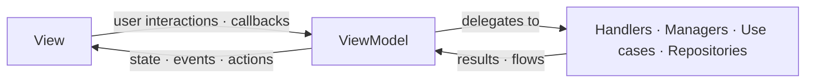
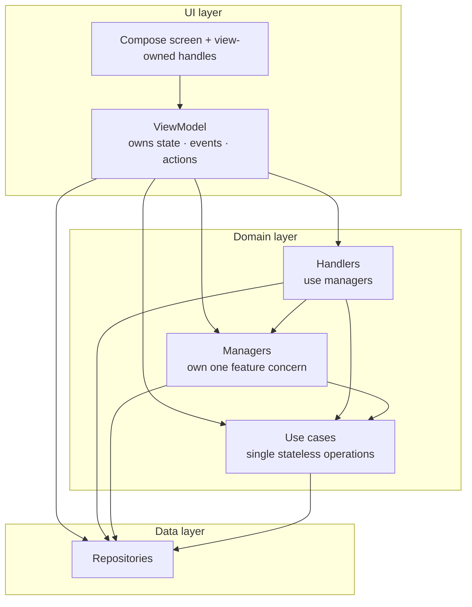

This page describes how a screen is structured in the app. It is an MVI-like take on [Google's recommended app architecture](https://developer.android.com/topic/architecture): the same UI, domain, and data layers, with a stricter contract for how a screen's inputs and outputs flow. New UI should follow it, and existing screens are migrated to it over time. The [Frontend screen](/docs/android/frontend_screen) is the reference implementation.

## The pattern

A screen often has many concurrent input sources: the user, system callbacks (permissions, the file chooser), timers, and external channels. The pattern reduces all of them into a few well-defined outputs, so the screen stays predictable and testable.

It is also what keeps screens maintainable. The app has many features, and a single screen can pull in a lot of them. Without structure that leads to a screen class or ViewModel that knows everything and can't be tested or changed safely. Instead, each concern lives in its own small block with a single responsibility (see [Building blocks](#building-blocks)), so a screen stays easy to work with as it grows.

### Unidirectional data flow

Inputs (user interactions, callbacks, external messages, system results) go down into the ViewModel, which delegates work to the blocks below it and reduces their results into the channels that flow back up:

- a single state: what to render;
- one-shot events: navigation and other fire-and-forget side effects;
- actions: imperative commands for an object owned by the view.

A given input produces only the outputs it needs, often just a new state, sometimes none. Actions exist only on screens where the view owns an imperative object such as a `WebView`; most screens don't need them (see [Actions](#actions)).



### Building blocks

Each block has a single responsibility and a defined way of talking to its neighbours.

#### View

The Compose screen. It renders from the current state, holds any UI handles the lower layers must not touch (a `WebView`, a list's scroll state, ...), runs queued [actions](#actions) against those handles, observes pending state exposed by managers, and reports user interactions back to the ViewModel through callbacks.

Split it into a stateful entry point and a stateless content composable so previews and Compose tests can drive it directly:

```kotlin
@Composable
internal fun SettingsScreen(viewModel: SettingsViewModel) {
    val viewState by viewModel.viewState.collectAsStateWithLifecycle()

    SettingsScreenContent(
        viewState = viewState,
        onNameChange = viewModel::onNameChange,
    )
}

@Composable
internal fun SettingsScreenContent(viewState: SettingsViewState, onNameChange: (String) -> Unit) {
    // Stateless: renders viewState and reports interactions through the callbacks.
}
```

#### ViewModel

The ViewModel owns the screen's output channels and wires the blocks below together: it reduces every input into a new state, a one-shot event, or a queued action. A typical shape:

```kotlin
val viewState: StateFlow<UiState> // what to render
val events: SharedFlow<UiEvent>   // one-shot side effects
val actions: Flow<UiAction>       // only when the view owns an imperative handle
```

It never references Compose or platform UI types, so its logic runs as plain JVM unit tests. It also outlives configuration changes: `viewModelScope` is cancelled only when the screen is permanently gone, so a rotation doesn't cancel and restart long-running work such as loading or flow collection.

Keep it thin. A small screen's ViewModel can hold its feature logic directly. As the screen grows, extract cohesive logic into the [blocks below](#blocks) rather than letting the ViewModel mix unrelated concerns. Its own job is coordination: owning the channels and routing inputs, not every feature's internals.

##### State

The single source of truth for what is rendered. The ViewModel holds it in a `StateFlow`, which is what makes it survive recomposition and configuration changes.

The state class must be immutable: use `val` properties and immutable collections, and produce a new instance (via `copy()`) for each change. In-place mutation breaks Compose's change detection and the unidirectional flow. Re-emitting the same state must be a no-op.

The state must also be cheap to read. Compose reads it on the main thread during recomposition, so don't expose a `get()` that computes anything (sorting, filtering, formatting): it would run again on every recomposition. Pre-compute such values when the state is created, in the ViewModel or a block below, where the work can run on a background dispatcher:

```kotlin
// Bad: builds the dropdown items on the main thread, on every recomposition
data class UiState(val servers: List<Server>) {
    val serverItems: List<HADropdownItem<Int>>
        get() = servers.map { HADropdownItem(key = it.id, label = it.friendlyName) }
}

// Good: mapped once when the state is created
data class UiState(val serverItems: List<HADropdownItem<Int>>)
```

Shape it to the screen:

- a single data class when the screen always has the same shape and only its fields change;
- a sealed hierarchy when the screen has genuinely distinct modes, for example:

```kotlin
sealed interface UiState {
    data object Loading : UiState
    data class Content(val items: List<Item>) : UiState
    data class Error(val error: ErrorReason) : UiState
}
```

With a sealed hierarchy the compiler enforces exhaustive handling, and one mode's fields can't leak into another, unlike a flat model whose nullable fields and booleans can express impossible combinations.

##### Events

One-shot, fire-and-forget effects: navigate, show a snackbar, open a link. Model them as a sealed interface (or sealed class when variants share fields), so the set of effects is closed and the event handler's `when` is exhaustive; the compiler then flags any unhandled event:

```kotlin
sealed interface UiEvent {
    data object NavigateBack : UiEvent
    data class ShowSnackbar(@StringRes val messageResId: Int) : UiEvent
    data class OpenExternalLink(val uri: Uri) : UiEvent
}
```

Emit them on a `Flow` and consume each exactly once, usually in the navigation layer, which holds the navigation controller and host callbacks. Events must not be persisted or replayed: replaying a "navigate" on recomposition would navigate twice. If the UI must be able to show it again after a configuration change, it is state, not an event.

##### Actions

Some imperative objects have to live in the view because the UI framework creates them inside the composition: a `WebView`, a `LazyListState`, a focus requester. The ViewModel must not hold a reference to one, that would tie it to platform UI types and break its unit testability. Yet some operations on them are genuinely imperative ("reload now", "scroll to top", "evaluate this script") and can't be expressed as declarative state.

The action queue resolves that tension: the ViewModel emits a typed action onto a `Flow`, and the view collects it and runs it against the handle it owns. Like events, model actions as a sealed interface so the set of commands is closed, with each variant carrying its own `run` against the handle:

```kotlin
sealed interface WebViewAction {
    fun run(webView: WebView)

    data object Reload : WebViewAction {
        override fun run(webView: WebView) = webView.reload()
    }

    data class EvaluateScript(val script: String) : WebViewAction {
        override fun run(webView: WebView) {
            webView.evaluateJavascript(script, null)
        }
    }
}

// In the view, the only place that holds the WebView:
LaunchedEffect(webView) {
    webViewActions.collect { action -> action.run(webView) }
}
```

An awaitable variant carries a `CompletableDeferred` so the caller can await a result, for example a script's return value.

The flow is a consumed-once `SharedFlow`, buffered so commands aren't dropped while the view is momentarily unavailable. It is deliberately not state: a command held as state would re-run on every recomposition. It is also not an event: an event is a signal the host reacts to (navigate, snackbar), while an action drives a specific object this screen owns.

Reserve actions for objects that must live in the view. Anything a lower layer can own should be owned there instead: a media player, for example, is held by a manager and surfaced through state, with no action queue involved. In practice a screen has at most one such handle, often none.

#### Blocks

The ViewModel delegates feature logic to four kinds of blocks. Together they are the domain and data layers of the screen.

##### Handlers

A handler is logic pulled out of the ViewModel that uses one or more managers. It's where coordination lives: the ViewModel should stay thin, and a manager may never depend on another manager. A handler can be a one-shot translator (mapping one input to a typed result) or a multi-step flow that drives several managers across an async round trip; it may be stateless or hold transient flow state. None of that is what defines it: depending on a manager is.

It hands its work back to the ViewModel as a sealed result (pull) or a flow of results (push). It may keep its own feature-scoped state, which the ViewModel maps into the screen state. The screen's single state always belongs to the ViewModel, never the handler.

##### Managers

A manager owns the logic and in-memory state of exactly one feature concern. It depends only on repositories, use cases, and platform APIs, never on another manager. If it would need one, that coordination is a [handler](#handlers)'s job. It talks to the ViewModel and view in one or more of three ways:

- push pending state: expose a `StateFlow<T?>` the view observes and renders;
- pull a result: a `suspend` function returning a sealed result the ViewModel handles;
- pull a stream: a `Flow` of results the ViewModel collects.

Managers are also where user prompts live: interactions that must show UI and wait for the user's answer, such as a dialog, a permission request, or a file picker. For these, use `SingleSlotQueue`, which serializes prompts when only one can be on screen at a time. The queue itself is a `StateFlow<T?>` of the current request (it implements the interface by delegation), so the manager exposes it as pending state the view renders, and `awaitResult { onResult -> ... }` suspends the caller until the UI invokes `onResult`, then frees the slot for the next request. A prompt is not a fourth output channel: it composes rendered pending state with the answer arriving as a regular input, and `awaitResult` collapses that round trip into one suspending call.

##### Use cases

A use case is a single reusable operation, stateless, named after the action it performs and exposed as a simple method or `operator fun invoke(...)`:

```kotlin
class CheckLocalNetworkPermissionUseCase @Inject constructor(
    private val serverManager: ServerManager,
    ...
) {
    suspend operator fun invoke() { ... }
}
```

Reach for one when a piece of logic is needed by more than one caller, or would bloat a ViewModel or manager, but has no state of its own. A use case may depend on repositories, never on managers or handlers. Examples in the codebase: `CheckLocalNetworkPermissionUseCase`, `ServerChooserItemsUseCase`.

##### Repositories

A repository is the single source of truth for one data source or communication channel, abstracting where the data lives (storage, network, an external channel). It has no UI concerns. Database access also goes through a repository, which talks to the [Room](https://developer.android.com/training/data-storage/room) database via its DAOs: the DAO is the data source, the repository is the abstraction the rest of the app sees.

A repository should not depend on another repository: combining several data sources is logic, and logic lives in a use case, manager, or handler.

### Layers and the dependency rule

The blocks map onto the layers of [Google's recommended architecture](https://developer.android.com/topic/architecture): the view and ViewModel are the UI layer, handlers, managers, and use cases form the domain layer, and repositories are the data layer. Dependencies point downward only, so the graph is acyclic by construction:



Every edge points down. At runtime, data flows back up as state, events, and actions through the flows each layer exposes.

- One rule decides the layer. A manager depends only on repositories, use cases, and platform APIs; a handler is anything that depends on a manager. A manager that would need another manager is, by that definition, a handler, so `manager → manager` can't occur.
- Downward only. No `handler → handler` (coordinate handlers in the ViewModel), no `repository → repository` (combine data sources in a use case, manager, or handler), and no up edges (a use case or manager never depends on a handler).
- The ViewModel can reach any layer directly. When the logic is small it uses a manager, use case, or repository itself; it extracts a handler only once coordination across managers would otherwise bloat it (see [ViewModel](#viewmodel)).

This keeps every block independently testable and prevents hidden cycles.

#### Scoping

Scope each block to how long its state must live. A block tied to one screen is `@ViewModelScoped`: one shared instance per screen session, so everything that injects it sees the same state, and that state resets when the session ends. A repository or manager that represents an app-wide concern is usually `@Singleton`.

The shared-instance part matters for any stateful block several places depend on. If the ViewModel and a handler both inject it, they must get the same object, or their views of the state diverge; an unscoped binding hands each consumer its own copy.

:::note
Provide everything through Hilt. Never instantiate these blocks manually.
:::

### Choosing an output

Ask what the output is, not where it is produced:

| If the output... | Use | Why |
|---|---|---|
| determines what is rendered and must survive recomposition/rotation | [state](#state) | durable UI; re-emitting the same value must be a no-op |
| is a one-time side effect that must fire exactly once and must not replay | [event](#events) | replaying it (for example, on recomposition) would double-navigate or double-toast |
| is an imperative command for a view-owned handle | [action](#actions) | the ViewModel stays UI-free; only the view holds the handle |
| needs to prompt the user and await a serialized response | [prompt](#managers) | one prompt at a time; the caller suspends until the user answers |

### Choosing a building block

Work top-down; the first row that matches wins:

| What you have | Pick | Deciding question |
|---|---|---|
| Access to a data source or a communication channel | [Repository](#repositories) | "Single source of truth for some data/IO?" |
| A single reusable operation with no state of its own | [Use case](#use-cases) | "One stateless operation?" |
| One feature's concern, with its own in-memory state | [Manager](#managers) | "Does it depend only on repositories and use cases?" |
| Logic that coordinates one or more managers | [Handler](#handlers) | "Does it depend on a manager?" |
| Composing features and owning what's on screen | [ViewModel](#viewmodel) | "Screen-wide state or coordination?" |

Handler vs manager comes down to one question: does it depend on a manager? Don't reach for "stateless vs stateful" or "translates vs coordinates", a handler can be either. The dependency is the whole test, and it's what keeps `manager → manager` impossible by construction.

What statefulness does affect is scope: a stateful block must be scoped so its state has the right lifetime and so every consumer shares one instance (see [Scoping](#scoping)).

Naming follows the block: `*Repository`, `*UseCase`, `*Manager`, `*Handler`.

### Testing

The separation is what makes the screen testable:

| Layer | Test type | Focus |
|---|---|---|
| ViewModel | Unit | Reduction logic: which input produces which state / event / action. |
| Handlers, managers, use cases | Unit | Each concern in isolation; assert the returned sealed result or emitted pending state. |
| Stateless screen content | Compose UI | Rendering per state, and that interactions invoke the right callback. |
| Event handler | Compose UI | Each event, when emitted, triggers the right navigation / side effect. |
| Screen | Screenshot | Visual regression only (no logic). |

The ViewModel and every block below it are free of Compose and platform UI types, which is why they run as ordinary JVM unit tests. For the project's conventions, see the [testing overview](/docs/android/testing/introduction), [unit tests](/docs/android/testing/unit_testing), and [screenshot tests](/docs/android/testing/screenshot_testing).

## The frontend screen

`FrontendScreen`, which renders the Home Assistant frontend in a WebView, is the reference implementation of this pattern and the most complex screen in the app. It has its own page: [Frontend screen](/docs/android/frontend_screen).
