Home Assistant iOS is a multi-target Apple platform project. It started as a companion app centered around a web experience and has grown into a hybrid codebase with native onboarding, sensors, widgets, Apple Watch support, CarPlay, App Intents, and notification-driven features.

The repository combines app-specific code, shared platform code, extensions, and a small Swift server component in a single workspace.

## Core principles

### Multi-target by design

The repository is organized to share as much logic as possible across targets while still allowing platform-specific implementations where needed. Cross-cutting concerns such as database access, networking, design system pieces, notifications, widgets, and shared models live in common modules so multiple targets can reuse them. See the [targets guide](/docs/apple/targets) for an overview of each surface.

### Hybrid UI stack

The project uses both **SwiftUI** and **UIKit**. Newer flows and components increasingly use SwiftUI, while legacy and platform-specific integrations still rely on UIKit and other Apple frameworks directly.

## Repository structure

### `Sources/App`

This contains iOS app-specific functionality such as onboarding, settings, scenes, cameras, notifications, web/frontend integration, kiosk features, and utilities.

### `Sources/Shared`

This is the heart of the shared codebase. It includes:

- API and networking support
- Database code built around GRDB
- Shared models and domain logic
- Design system utilities
- Widget and notification support
- Location, Assist, and service integrations

### `Sources/Extensions`

This area contains code for extensions and system integrations, including:

- Widgets
- App Intents
- Share extension
- Notification service and content extensions
- Matter support
- Push provider support

### Other important directories

- `Sources/CarPlay`: CarPlay templates and feature logic
- `Sources/Watch` and `Sources/WatchApp`: Apple Watch communication and watch app code
- `Sources/Thread`: Thread credential management and sharing flows
- `Sources/MacBridge`: macOS-specific bridge code used for Mac builds
- `Sources/PushServer` and `Sources/SharedPush`: Swift package-based server and shared push logic
- `Tests`: App, shared, UI, and widget tests
- `fastlane`: Linting, testing, versioning, and build automation

## Key technologies

The current codebase makes heavy use of:

- [**Swift**](https://www.swift.org/)
- **Xcode workspaces and schemes**
- [**CocoaPods**](https://cocoapods.org/)
- [**Fastlane**](https://fastlane.tools/)
- [**WKWebView**](https://developer.apple.com/documentation/webkit/wkwebview) for frontend integration
- [**SwiftUI**](https://developer.apple.com/xcode/swiftui/) and [**UIKit**](https://developer.apple.com/documentation/uikit)
- [**App Intents**](https://developer.apple.com/documentation/appintents) and [**WidgetKit**](https://developer.apple.com/documentation/widgetkit)

## Notable third-party dependencies

Beyond Apple frameworks, the app relies on several open-source libraries. The complete list lives in the [`Podfile`](https://github.com/home-assistant/iOS/blob/main/Podfile), but these are the most commonly touched:

- [**HAKit**](https://github.com/home-assistant/HAKit) — Home Assistant API client (WebSocket and REST)
- [**GRDB.swift**](https://github.com/groue/GRDB.swift) — SQLite database access
- [**Alamofire**](https://github.com/Alamofire/Alamofire) — HTTP networking
- [**PromiseKit**](https://github.com/mxcl/PromiseKit) — promise-based async flows
- [**Starscream**](https://github.com/daltoniam/Starscream) — WebSocket transport used by HAKit (we track a fork with a specific fix)
- [**SFSafeSymbols**](https://github.com/SFSafeSymbols/SFSafeSymbols) — type-safe access to SF Symbols
- [**KeychainAccess**](https://github.com/kishikawakatsumi/KeychainAccess) — keychain storage helper
- [**Eureka**](https://github.com/xmartlabs/Eureka) — form-based UI in legacy screens
- [**ObjectMapper**](https://github.com/tristanhimmelman/ObjectMapper) — JSON mapping in legacy models
- [**XCGLogger**](https://github.com/DaveWoodCom/XCGLogger) — logging
- [**Improv-iOS**](https://github.com/home-assistant/Improv-iOS) — Improv Bluetooth onboarding

## Architectural patterns in practice

### Shared environment access

The project uses a shared `Current` environment pattern (see [How to control the world](https://www.pointfree.co/blog/posts/21-how-to-control-the-world)) in many places to access dependencies and services. In practice, this means a single `Current` value groups the dependencies the app needs, which makes them easy to read from anywhere and easy to swap out in tests. The codebase treats this carefully enough that SwiftLint has a custom rule to prevent casual reassignment.

### Extensions are first-class

We encourage you to take widgets, notifications, CarPlay, watchOS support, and App Intents into account from the start. The app needs to work well across all these surfaces while maintaining code quality, so changes often need to consider extension-safe code, shared storage, and cross-target reuse.

### App plus platform surfaces

A feature may touch more than the main app. For example, an entity action could appear in the app UI, widgets, Apple Watch, App Intents, or CarPlay. It is worth checking whether a change belongs in `Sources/App`, `Sources/Shared`, or an extension target before you start coding.

## How to navigate the codebase

The diagram below shows the actual Xcode shipping products on top and the `Sources/*` directories that feed into each one. Read it in either direction:

- **Starting from a product** (for example, the Apple Watch app): follow the arrows out to see every source directory that ships in it.
- **Starting from a source directory** (for example, `Shared`): follow the inbound arrows to see every product that consumes it.

Click any node on the bottom row to jump to that directory on GitHub. All source paths are relative to [`Sources/`](https://github.com/home-assistant/iOS/tree/main/Sources).

```mermaid
graph TB;
    subgraph Products["Shipping products (Xcode targets)"]
        direction LR
        AppProduct["Home Assistant app<br/>(iPhone, iPad, Mac Catalyst)"]
        AppExts["App extensions<br/>(widgets, App Intents, Siri intents,<br/>notifications, share, Matter, push provider)"]
        WatchProduct["Apple Watch app"]
        LauncherProduct["macOS launcher"]
    end

    subgraph Code["Source directories"]
        direction TB
        SrcApp[App]
        SrcCarPlay[CarPlay]
        SrcImprov[Improv]
        SrcThread[Thread]
        SrcMacBridge[MacBridge]
        SrcExtensions[Extensions]
        SrcWatchApp[WatchApp]
        SrcWatch[Watch]
        SrcLauncher[Launcher]
        SrcSharedPush[SharedPush]

        subgraph SharedGroup["Shared"]
            direction LR
            Shared_API[API]
            Shared_Networking[Networking]
            Shared_ExternalMessageModels[ExternalMessageModels]
            Shared_Database[Database]
            Shared_Models[Models]
            Shared_Domain[Domain]
            Shared_Assist[Assist]
            Shared_ClientEvents[ClientEvents]
            Shared_Intents[Intents]
            Shared_LiveActivity[LiveActivity]
            Shared_Location[Location]
            Shared_MagicItem[MagicItem]
            Shared_Notifications[Notifications]
            Shared_Panels[Panels]
            Shared_Settings[Settings]
            Shared_Widget[Widget]
            Shared_DesignSystem[DesignSystem]
            Shared_Assets[Assets]
            Shared_Iconic[Iconic]
            Shared_Toast[Toast]
            Shared_Resources[Resources]
            Shared_Common[Common]
            Shared_Environment[Environment]
            Shared_Extensions[Extensions]
            Shared_Services[Services]
            Shared_Utilities[Utilities]
            Shared_Watch[Watch]
        end
    end

    AppProduct --> SrcApp
    AppProduct --> SrcCarPlay
    AppProduct --> SrcImprov
    AppProduct --> SrcThread
    AppProduct --> SrcMacBridge
    AppProduct --> SharedGroup
    AppProduct --> SrcSharedPush

    AppExts --> SrcExtensions
    AppExts --> SharedGroup
    AppExts --> SrcSharedPush

    WatchProduct --> SrcWatchApp
    WatchProduct --> SrcWatch
    WatchProduct --> SharedGroup

    LauncherProduct --> SrcLauncher

    click SrcApp "https://github.com/home-assistant/iOS/tree/main/Sources/App" "Open Sources/App on GitHub"
    click SrcCarPlay "https://github.com/home-assistant/iOS/tree/main/Sources/CarPlay" "Open Sources/CarPlay on GitHub"
    click SrcImprov "https://github.com/home-assistant/iOS/tree/main/Sources/Improv" "Open Sources/Improv on GitHub"
    click SrcThread "https://github.com/home-assistant/iOS/tree/main/Sources/Thread" "Open Sources/Thread on GitHub"
    click SrcMacBridge "https://github.com/home-assistant/iOS/tree/main/Sources/MacBridge" "Open Sources/MacBridge on GitHub"
    click SrcExtensions "https://github.com/home-assistant/iOS/tree/main/Sources/Extensions" "Open Sources/Extensions on GitHub"
    click SrcWatchApp "https://github.com/home-assistant/iOS/tree/main/Sources/WatchApp" "Open Sources/WatchApp on GitHub"
    click SrcWatch "https://github.com/home-assistant/iOS/tree/main/Sources/Watch" "Open Sources/Watch on GitHub"
    click SrcLauncher "https://github.com/home-assistant/iOS/tree/main/Sources/Launcher" "Open Sources/Launcher on GitHub"
    click SrcSharedPush "https://github.com/home-assistant/iOS/tree/main/Sources/SharedPush" "Open Sources/SharedPush on GitHub"

    click Shared_API "https://github.com/home-assistant/iOS/tree/main/Sources/Shared/API" "Open Sources/Shared/API on GitHub"
    click Shared_Networking "https://github.com/home-assistant/iOS/tree/main/Sources/Shared/Networking" "Open Sources/Shared/Networking on GitHub"
    click Shared_ExternalMessageModels "https://github.com/home-assistant/iOS/tree/main/Sources/Shared/ExternalMessageModels" "Open Sources/Shared/ExternalMessageModels on GitHub"
    click Shared_Database "https://github.com/home-assistant/iOS/tree/main/Sources/Shared/Database" "Open Sources/Shared/Database on GitHub"
    click Shared_Models "https://github.com/home-assistant/iOS/tree/main/Sources/Shared/Models" "Open Sources/Shared/Models on GitHub"
    click Shared_Domain "https://github.com/home-assistant/iOS/tree/main/Sources/Shared/Domain" "Open Sources/Shared/Domain on GitHub"
    click Shared_Assist "https://github.com/home-assistant/iOS/tree/main/Sources/Shared/Assist" "Open Sources/Shared/Assist on GitHub"
    click Shared_ClientEvents "https://github.com/home-assistant/iOS/tree/main/Sources/Shared/ClientEvents" "Open Sources/Shared/ClientEvents on GitHub"
    click Shared_Intents "https://github.com/home-assistant/iOS/tree/main/Sources/Shared/Intents" "Open Sources/Shared/Intents on GitHub"
    click Shared_LiveActivity "https://github.com/home-assistant/iOS/tree/main/Sources/Shared/LiveActivity" "Open Sources/Shared/LiveActivity on GitHub"
    click Shared_Location "https://github.com/home-assistant/iOS/tree/main/Sources/Shared/Location" "Open Sources/Shared/Location on GitHub"
    click Shared_MagicItem "https://github.com/home-assistant/iOS/tree/main/Sources/Shared/MagicItem" "Open Sources/Shared/MagicItem on GitHub"
    click Shared_Notifications "https://github.com/home-assistant/iOS/tree/main/Sources/Shared/Notifications" "Open Sources/Shared/Notifications on GitHub"
    click Shared_Panels "https://github.com/home-assistant/iOS/tree/main/Sources/Shared/Panels" "Open Sources/Shared/Panels on GitHub"
    click Shared_Settings "https://github.com/home-assistant/iOS/tree/main/Sources/Shared/Settings" "Open Sources/Shared/Settings on GitHub"
    click Shared_Widget "https://github.com/home-assistant/iOS/tree/main/Sources/Shared/Widget" "Open Sources/Shared/Widget on GitHub"
    click Shared_DesignSystem "https://github.com/home-assistant/iOS/tree/main/Sources/Shared/DesignSystem" "Open Sources/Shared/DesignSystem on GitHub"
    click Shared_Assets "https://github.com/home-assistant/iOS/tree/main/Sources/Shared/Assets" "Open Sources/Shared/Assets on GitHub"
    click Shared_Iconic "https://github.com/home-assistant/iOS/tree/main/Sources/Shared/Iconic" "Open Sources/Shared/Iconic on GitHub"
    click Shared_Toast "https://github.com/home-assistant/iOS/tree/main/Sources/Shared/Toast" "Open Sources/Shared/Toast on GitHub"
    click Shared_Resources "https://github.com/home-assistant/iOS/tree/main/Sources/Shared/Resources" "Open Sources/Shared/Resources on GitHub"
    click Shared_Common "https://github.com/home-assistant/iOS/tree/main/Sources/Shared/Common" "Open Sources/Shared/Common on GitHub"
    click Shared_Environment "https://github.com/home-assistant/iOS/tree/main/Sources/Shared/Environment" "Open Sources/Shared/Environment on GitHub"
    click Shared_Extensions "https://github.com/home-assistant/iOS/tree/main/Sources/Shared/Extensions" "Open Sources/Shared/Extensions on GitHub"
    click Shared_Services "https://github.com/home-assistant/iOS/tree/main/Sources/Shared/Services" "Open Sources/Shared/Services on GitHub"
    click Shared_Utilities "https://github.com/home-assistant/iOS/tree/main/Sources/Shared/Utilities" "Open Sources/Shared/Utilities on GitHub"
    click Shared_Watch "https://github.com/home-assistant/iOS/tree/main/Sources/Shared/Watch" "Open Sources/Shared/Watch on GitHub"
```

A few pieces live outside the main workspace:

- [`Sources/PushServer`](https://github.com/home-assistant/iOS/tree/main/Sources/PushServer) is a standalone Swift package for the server-side push relay.
- [`Sources/SharedTesting`](https://github.com/home-assistant/iOS/tree/main/Sources/SharedTesting) is a test-only framework used by the test targets.

If you are new to the repository, a good way to orient yourself is:

1. Start in `Sources/App` to see how the main iPhone and iPad app is structured. Most features originate here.
2. Place logic that multiple targets need in `Sources/Shared` so it can be reused by extensions, watch, and CarPlay.
3. For target-specific features (for example a watch-only or widget-only change), look in `Sources/Extensions`, `Sources/CarPlay`, or `Sources/Watch` for the matching surface.
4. Look in `Tests/App` and `Tests/Shared` for examples before adding new code.
