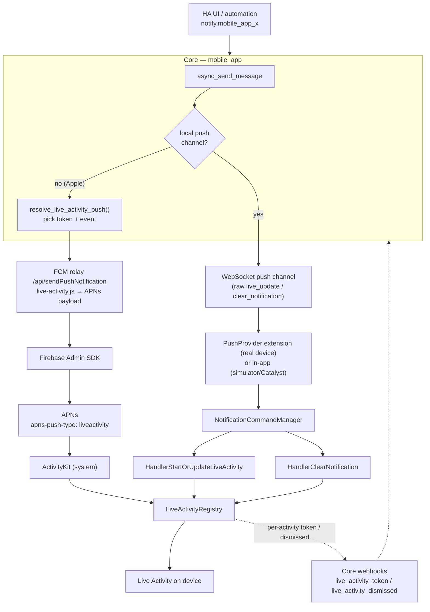

A [Live Activity](https://developer.apple.com/documentation/activitykit) is a glanceable, frequently-updated view that ActivityKit renders on the Lock Screen and in the Dynamic Island. Home Assistant can start, update, and end one from a normal `notify.mobile_app_*` action.

This page traces a Live Activity end to end — from a notify action in Home Assistant, through Core, out over either the **Firebase relay** or **local push**, into Firebase/APNs, and finally into the iOS app — and tells you exactly which file owns each step.

Three repositories are involved:

| Repo | Role |
| --- | --- |
| [`home-assistant/core`](https://github.com/home-assistant/core) | Owns the `notify.mobile_app_*` action; decides whether a payload starts/updates/ends a Live Activity and picks the right token. |
| [`home-assistant/mobile-apps-fcm-push`](https://github.com/home-assistant/mobile-apps-fcm-push) | The relay. Translates Core's request into an FCM/APNs ActivityKit payload. |
| [`home-assistant/iOS`](https://github.com/home-assistant/iOS) | Registers tokens, receives ActivityKit/notification events, renders the widget, and reports per-activity tokens and dismissals back to Core. |

## The big picture

## Two tokens, three events

Everything hinges on **two APNs tokens** and **three lifecycle events**.

**Tokens** (both produced by ActivityKit on the device, both reported to Core):

- **Push-to-start token** — lets APNs start a *new* Live Activity even when the app is not running. iOS reports it to Core in the registration `app_data` as `start_live_activity_token` (plus `live_activity_push_to_start_apns_environment`). See Apple's [push-to-start token](https://developer.apple.com/documentation/activitykit/activity/pushtostarttokenupdates).
- **Per-activity token** — once an activity is running, this token addresses *that specific activity* for updates and ends. iOS reports it via the `live_activity_token` webhook. See Apple's [updating Live Activities with push](https://developer.apple.com/documentation/activitykit/starting-and-updating-live-activities-with-activitykit-push-notifications).

**Events** that Core derives from the notification, in [`resolve_live_activity_push`](https://github.com/home-assistant/core/blob/dev/homeassistant/components/mobile_app/live_activity/__init__.py) (`live_activity/__init__.py`):

| Condition (notification `data`) | Event | Token used |
| --- | --- | --- |
| `live_update: true`, a `tag`, **no** stored per-activity token | `start` | push-to-start |
| `live_update: true`, a `tag`, stored per-activity token | `update` | per-activity |
| `message: clear_notification`, a `tag`, stored per-activity token | `end` | per-activity |

A `tag` is **required** — it is the identity that ties a start, its updates, and its end together. Without one, the notification is sent as a normal push.

## The journey, hop by hop

### 1. Home Assistant to the Core notify action

A user or automation calls `notify.mobile_app_<device>` with `data.live_update: true` and a `tag` (see the user-facing [notifications API](/docs/api/native-app-integration/notifications)). This lands in [`MobileAppNotificationService.async_send_message`](https://github.com/home-assistant/core/blob/dev/homeassistant/components/mobile_app/notify.py) (`notify.py`).

### 2. Core picks the route, token, and event

`async_send_message` chooses the transport per target:

- If the device has an open **WebSocket push channel**, the raw payload is sent over it as **local push** (step 3b).
- Otherwise it goes **cloud** through `_async_send_remote_message_target` to the **Firebase relay** (step 3a).

The Live Activity translation runs **only on the cloud path**, and **only for Apple devices**: `_async_send_remote_message_target` calls [`prepare_live_activity_remote_push`](https://github.com/home-assistant/core/blob/dev/homeassistant/components/mobile_app/live_activity/__init__.py), which calls `resolve_live_activity_push` to pick the token and event, attaches `live_activity_token` and `data.event` to the payload, and (on a successful `end`) clears the stored token via [`remove_live_activity_token`](https://github.com/home-assistant/core/blob/dev/homeassistant/components/mobile_app/live_activity/store.py) in `store.py`.

:::note
The local-push path sends the **raw** `live_update` / `clear_notification` command — Core does **not** add a token or event there. The app drives ActivityKit itself in that case (see [Local push vs Firebase](#local-push-vs-firebase-push)).
:::

### 3a. Cloud: relay, Firebase, and APNs

`_send_message` POSTs the payload (now carrying `live_activity_token` and `event`) to the device's `push_url`, the relay's `/api/sendPushNotification` endpoint ([`functions/webapp.js`](https://github.com/home-assistant/mobile-apps-fcm-push/blob/main/functions/webapp.js)).

- [`functions/legacy.js`](https://github.com/home-assistant/mobile-apps-fcm-push/blob/main/functions/legacy.js): if `live_activity_token` is present it routes to `liveActivity.createPayload(req)`; otherwise it falls back to a normal notification and logs `missing_live_activity_token`.
- [`createPayload`](https://github.com/home-assistant/mobile-apps-fcm-push/blob/main/functions/live-activity.js) in `functions/live-activity.js` builds the ActivityKit APNs message: `event` (`start`/`update`/`end`), `attributes-type` (**must exactly match the Swift struct name** `HALiveActivityAttributes`), `content-state`, and the `liveActivityToken` (camelCase) — which tells the Firebase Admin SDK to set `apns-push-type: liveactivity` and the right APNs topic.

Firebase forwards to APNs, and ActivityKit on the device acts on it. A successful start logs `mode: live_activity, event: start`.

### 3b. Local push over the WebSocket

When a WebSocket push channel exists, Core sends the raw notification over `mobile_app/push_notification_channel`. On the app side the channel is serviced differently per environment ([`NotificationManager`](https://github.com/home-assistant/iOS/blob/main/Sources/App/Notifications/NotificationManager.swift)):

- **Real device**: the [`PushProvider` Network Extension](https://developer.apple.com/documentation/networkextension/neapppushprovider) (`NotificationManagerLocalPushInterfaceExtension`) — a **separate process**.
- **Simulator / Mac Catalyst**: in-app (`NotificationManagerLocalPushInterfaceDirect`).

The push is parsed by [`LocalPushEvent`](https://github.com/home-assistant/iOS/blob/main/Sources/Shared/Notifications/LocalPush/LocalPushEvent.swift) using [`NotificationParserLegacy`](https://github.com/home-assistant/iOS/blob/main/Sources/SharedPush/Sources/NotificationParserLegacy.swift) (which maps the `clear_notification` *message* to a `command`), then dispatched by [`NotificationCommandManager`](https://github.com/home-assistant/iOS/blob/main/Sources/Shared/Notifications/NotificationCommands/NotificationsCommandManager.swift).

### 4. The app renders the Live Activity

All ActivityKit work funnels through the [`LiveActivityRegistry`](https://github.com/home-assistant/iOS/blob/main/Sources/Shared/LiveActivity/LiveActivityRegistry.swift) actor:

- `startOrUpdate(tag:title:state:)` — `Activity.request(...)` for a new activity, or `activity.update(...)` for an existing one.
- `end(tag:dismissalPolicy:)` — dismisses it.
- `reattach()` / `startObservingRemoteActivityStarts()` — re-adopt activities started by APNs push-to-start so the app can observe their tokens.

The widget UI itself lives in the Widgets extension: [`HALockScreenView`](https://github.com/home-assistant/iOS/blob/main/Sources/Extensions/Widgets/LiveActivity/HALockScreenView.swift) and [`HADynamicIslandView`](https://github.com/home-assistant/iOS/blob/main/Sources/Extensions/Widgets/LiveActivity/HADynamicIslandView.swift), driven by the wire-format struct [`HALiveActivityAttributes`](https://github.com/home-assistant/iOS/blob/main/Sources/Shared/LiveActivity/HALiveActivityAttributes.swift).

### 5. The app reports back to Core

`LiveActivityRegistry` observes ActivityKit token/lifecycle streams and calls back into Core via webhooks handled in [`live_activity/webhook.py`](https://github.com/home-assistant/core/blob/dev/homeassistant/components/mobile_app/live_activity/webhook.py):

- A new **per-activity token** is sent via the `live_activity_token` webhook `{tag, push_token, expires_at}` and stored per `(webhook_id, tag)`.
- A **dismissal** on device sends the `live_activity_dismissed` webhook `{tag}`, and the stored token is removed.
- A new **push-to-start token** is folded into a registration update in [`HAAPI.swift`](https://github.com/home-assistant/iOS/blob/main/Sources/Shared/API/HAAPI.swift) (`app_data.start_live_activity_token`).

This back-channel is what lets the *second* `live_update` for a tag become an `update` instead of another `start`.

## Local push vs Firebase push

The two transports drive ActivityKit in fundamentally different ways:

| | Firebase (cloud) | Local push |
| --- | --- | --- |
| Transport | Core → FCM relay → Firebase → APNs | Core → WebSocket → app/extension |
| Who creates/updates the activity | **ActivityKit/system**, via an APNs token push | **The app**, calling `Activity.request`/`update` directly |
| Token used | push-to-start (start) / per-activity (update, end) | none — the command itself carries the data |
| Core attaches `event` + token? | **Yes** (`prepare_live_activity_remote_push`) | **No** — raw `live_update` / `clear_notification` |
| Payload built by | `functions/live-activity.js` | n/a (app interprets the command) |
| Works when app is terminated? | Yes (push-to-start) | No (needs the app/extension running) |

### Handlers

Both transports ultimately reach the same two command handlers in [`NotificationsCommandManager.swift`](https://github.com/home-assistant/iOS/blob/main/Sources/Shared/Notifications/NotificationCommands/NotificationsCommandManager.swift):

- **`live_update: true`** routes to `HandlerStartOrUpdateLiveActivity` ([`HandlerLiveActivity.swift`](https://github.com/home-assistant/iOS/blob/main/Sources/Shared/Notifications/NotificationCommands/HandlerLiveActivity.swift)), which calls `LiveActivityRegistry.startOrUpdate`. It `guard`s `!Current.isAppExtension`, because ActivityKit is unavailable in the `PushProvider` extension; alert-bearing starts and updates are re-presented to the foreground app, which handles them where ActivityKit works.
- **`command: clear_notification`** routes to `HandlerClearNotification`, which calls `LiveActivityRegistry.end`.

## Ending a Live Activity over local push

`clear_notification` is a **silent** command, so on a real device it is processed only inside the `PushProvider` extension — which cannot touch ActivityKit and never reaches the app's foreground presentation path. To end the activity anyway, the extension hands off to the app:

1. `HandlerClearNotification`, when running in the extension, calls `LiveActivityPendingEnd.append(tag:)` (writes to the shared [App Group](https://developer.apple.com/documentation/xcode/configuring-app-groups)) and posts a [Darwin notification](https://developer.apple.com/documentation/corefoundation/cfnotificationcenter) via `postDarwinSignal()`.
2. In the app, `LiveActivityPendingEndObserver` (set up in [`AppDelegate`](https://github.com/home-assistant/iOS/blob/main/Sources/App/AppDelegate.swift) and re-drained on foreground in `NotificationManager.didBecomeActive`) observes the Darwin signal, drains the queue, and calls `LiveActivityRegistry.end(tag:)`.

The Darwin signal is the fast path; the persisted App Group queue is the durability guarantee (Darwin does not wake a suspended app, so the app also drains at launch and on foreground). Both `LiveActivityPendingEnd` and `LiveActivityPendingEndObserver` live in [`LiveActivityRegistry.swift`](https://github.com/home-assistant/iOS/blob/main/Sources/Shared/LiveActivity/LiveActivityRegistry.swift).

Firebase has no such problem: the relay sends an APNs `end` to the per-activity token and ActivityKit dismisses the activity regardless of app state.

## Where everything lives

### Core (`homeassistant/components/mobile_app/`)

| Concern | Location |
| --- | --- |
| `notify` action, transport routing | `notify.py` → `MobileAppNotificationService.async_send_message`, `_async_send_remote_message_target`, `_send_message` |
| Start/update/end decision + token pick | `live_activity/__init__.py` → `resolve_live_activity_push`, `prepare_live_activity_remote_push` |
| Per-activity token storage + expiry cleanup | `live_activity/store.py` |
| Inbound webhooks (`live_activity_token`, `live_activity_dismissed`) | `live_activity/webhook.py` |
| Field/event constants | `const.py` (`ATTR_START_LIVE_ACTIVITY_TOKEN`, `ATTR_LIVE_ACTIVITY_TOKEN`, …) |

### FCM relay (`functions/`)

| Concern | Location |
| --- | --- |
| HTTP route (`/api/sendPushNotification`) | `webapp.js` |
| Live-activity vs fallback routing | `legacy.js` |
| APNs ActivityKit payload builder | `live-activity.js` → `createPayload` |

### iOS (`Sources/`)

| Concern | Location |
| --- | --- |
| ActivityKit lifecycle (start/update/end, observation) | `Shared/LiveActivity/LiveActivityRegistry.swift` |
| Wire-format struct + content-state | `Shared/LiveActivity/HALiveActivityAttributes.swift` |
| Command dispatch | `Shared/Notifications/NotificationCommands/NotificationsCommandManager.swift` |
| Start/update handler | `Shared/Notifications/NotificationCommands/HandlerLiveActivity.swift` |
| End handler + extension→app hand-off | `HandlerClearNotification` (same file) + `LiveActivityPendingEnd` / `LiveActivityPendingEndObserver` in `LiveActivityRegistry.swift` |
| Token registration (push-to-start) | `Shared/API/HAAPI.swift` |
| Local push transport (device vs simulator) | `App/Notifications/NotificationManagerLocalPushInterface*.swift`, `Shared/Notifications/LocalPush/` |
| Notification parsing (message → command) | `SharedPush/Sources/NotificationParserLegacy.swift` |
| Widget UI | `Extensions/Widgets/LiveActivity/HALockScreenView.swift`, `HADynamicIslandView.swift` |
| Settings entry | `App/Settings/LiveActivity/LiveActivitySettingsView.swift`, `App/Settings/Settings/SettingsItem.swift` |

## Apple references

- [ActivityKit](https://developer.apple.com/documentation/activitykit)
- [Displaying live data with Live Activities](https://developer.apple.com/documentation/activitykit/displaying-live-data-with-live-activities)
- [Starting and updating Live Activities with ActivityKit push notifications](https://developer.apple.com/documentation/activitykit/starting-and-updating-live-activities-with-activitykit-push-notifications)
- [`NEAppPushProvider`](https://developer.apple.com/documentation/networkextension/neapppushprovider) · [App Groups](https://developer.apple.com/documentation/xcode/configuring-app-groups) · [`CFNotificationCenter` (Darwin)](https://developer.apple.com/documentation/corefoundation/cfnotificationcenter)

See also the [architecture overview](/docs/apple/architecture), the [targets guide](/docs/apple/targets), and the user-facing [native app notifications](/docs/api/native-app-integration/notifications).
