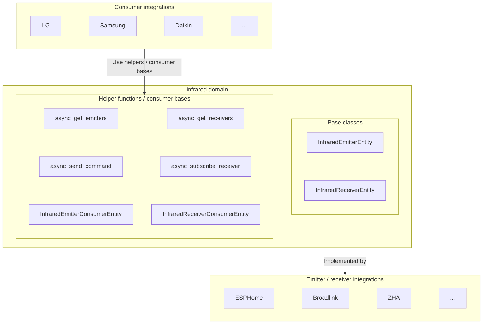

The infrared domain provides an abstraction layer between IR hardware (like ESPHome, Broadlink, or ZHA devices) and device-specific integrations that need to send or receive IR commands (like LG or Samsung TV controls). It defines two kinds of virtual entities — an **emitter** that transmits IR commands and a **receiver** that captures incoming IR signals — that other integrations can use to control or react to IR devices.

The emitter and receiver base classes live in [`homeassistant.components.infrared`](https://github.com/home-assistant/core/blob/dev/homeassistant/components/infrared/entity.py).

## Architecture overview

The infrared integration creates a separation between:

1. **Emitter integrations** (like ESPHome, Broadlink): These implement `InfraredEmitterEntity` to provide hardware-specific IR transmission.
2. **Receiver integrations** (like ESPHome, Broadlink): These implement `InfraredReceiverEntity` to provide hardware-specific IR reception.
3. **Consumer integrations** (like LG, Samsung): These use the infrared helper functions — or the provided consumer base classes — to send device-specific IR commands through an emitter and/or react to signals from a receiver.



## Device classes

Infrared entities expose an [`InfraredDeviceClass`](https://github.com/home-assistant/core/blob/dev/homeassistant/components/infrared/entity.py) that reflects their role:

| Value      | Meaning                                              |
| ---------- | ---------------------------------------------------- |
| `emitter`  | Sends IR commands. Set automatically by `InfraredEmitterEntity`. |
| `receiver` | Receives IR signals. Set automatically by `InfraredReceiverEntity`. |

Emitter and receiver integrations do not need to set the device class themselves — the base classes assign it.

## InfraredEmitterEntity

An emitter entity wraps a piece of IR emitter hardware. The base class is `InfraredEmitterEntity`, described by `InfraredEmitterEntityDescription`.

### State

The infrared emitter entity state represents the timestamp of when the last IR command was sent. This is implemented in the base InfraredEmitterEntity class and should not be changed by integrations.

### Send command method

The `InfraredEmitterEntity.async_send_command` method must be implemented by emitter integrations to handle the actual IR transmission.

```python
class MyInfraredEmitter(InfraredEmitterEntity):
    """My infrared emitter."""

    async def async_send_command(self, command: infrared_protocols.commands.Command) -> None:
        """Send an IR command.

        Args:
            command: The IR command to send.

        Raises:
            HomeAssistantError: If transmission fails.
        """
```

:::important
Consumer integrations must not call `InfraredEmitterEntity.async_send_command` directly. Use the [`async_send_command`](#send-command) helper (or the [`InfraredEmitterConsumerEntity`](#emitter-consumer-base-class) base class), which handles state updates and context propagation automatically.
:::

## InfraredReceiverEntity

A receiver entity wraps a piece of IR receiver hardware. The base class is `InfraredReceiverEntity`, described by `InfraredReceiverEntityDescription`.

### State

The infrared receiver entity state represents the timestamp of when the last IR signal was received. This is implemented in the base InfraredReceiverEntity class and should not be changed by integrations.

### Reporting received signals

Receiver integrations call `_handle_received_signal` from the base class whenever they observe an IR signal on the hardware. The base class updates the state and notifies subscribers.

```python
class MyInfraredReceiver(InfraredReceiverEntity):
    """My infrared receiver."""

    def _on_hardware_signal(self, timings: list[int], modulation: int | None) -> None:
        self._handle_received_signal(
            InfraredReceivedSignal(timings=timings, modulation=modulation)
        )
```

## Helper functions

The infrared domain exposes helper functions so consumer integrations can discover hardware and interact with it without holding direct references to entity instances.

### Get emitters

Returns the entity IDs of all available infrared emitter entities.

```python
from homeassistant.components import infrared

emitters = infrared.async_get_emitters(hass)
```

### Get receivers

Returns the entity IDs of all available infrared receiver entities.

```python
from homeassistant.components import infrared

receivers = infrared.async_get_receivers(hass)
```

### Send command

Sends an IR command through a specific emitter entity.

```python
from infrared_protocols.commands.nec import NECCommand
from homeassistant.components import infrared

command = NECCommand(
    address=0x04,
    command=0x08,
    modulation=38000,  # 38 kHz carrier frequency
)

await infrared.async_send_command(
    hass,
    emitter_entity_id,
    command,
    context=context,  # Optional context for logbook tracking
)
```


### Subscribe to a receiver

Subscribes to IR signals from a specific receiver entity. Returns an unsubscribe callback.

```python
from homeassistant.components import infrared
from homeassistant.components.infrared import InfraredReceivedSignal

@callback
def handle_signal(signal: InfraredReceivedSignal) -> None:
    ...

unsubscribe = infrared.async_subscribe_receiver(
    hass, receiver_entity_id, handle_signal
)
```

## Consumer base classes

Consumer integrations typically don't need to call the send/receive helpers directly. The infrared integration provides two base classes that take care of tracking the underlying hardware's availability and (for receivers) managing the subscription lifecycle.

### Emitter consumer base class

`InfraredEmitterConsumerEntity` tracks the availability of the configured emitter and exposes a `_send_command` method that forwards through `async_send_command`, including the entity's current context.

```python
from homeassistant.components.infrared import InfraredEmitterConsumerEntity

class MyButton(InfraredEmitterConsumerEntity, ButtonEntity):
    """A button that emits an IR command."""

    def __init__(self, emitter_entity_id: str) -> None:
        self._infrared_emitter_entity_id = emitter_entity_id

    async def async_press(self) -> None:
        await self._send_command(SOME_COMMAND)
```

The base class sets `self._attr_available` based on the emitter's state and updates it as the emitter becomes available or unavailable.

### Receiver consumer base class

`InfraredReceiverConsumerEntity` tracks the availability of the configured receiver, subscribes to its signals while available, and unsubscribes automatically when the receiver goes away. Subclasses implement `_handle_signal`.

```python
from homeassistant.components.infrared import (
    InfraredReceivedSignal,
    InfraredReceiverConsumerEntity,
)

class MyRemote(InfraredReceiverConsumerEntity, EventEntity):
    """An event entity that fires when an IR signal is received."""

    def __init__(self, receiver_entity_id: str) -> None:
        self._infrared_receiver_entity_id = receiver_entity_id

    @override
    @callback
    def _handle_signal(self, signal: InfraredReceivedSignal) -> None:
        ...
```

## IR commands

The [`infrared-protocols`](https://github.com/home-assistant-libs/infrared-protocols) library provides command classes that convert protocol-specific data (NEC, RC-5, Kaseikyo, etc.) to raw timings.


All IR commands inherit from `infrared_protocols.commands.Command` and implement `get_raw_timings()`.
