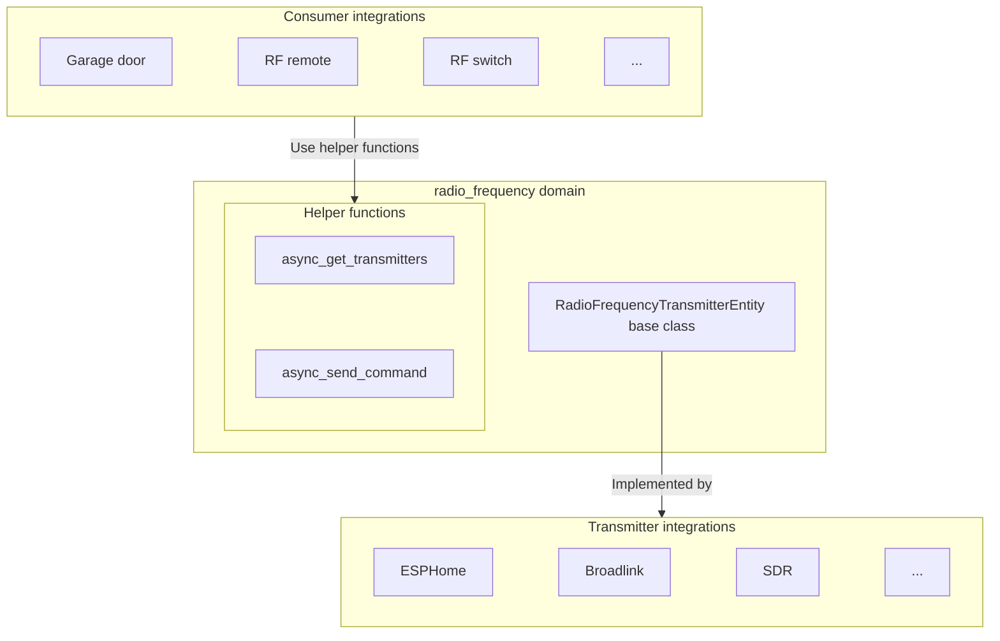

A radio frequency entity provides an abstraction layer between RF transceiver hardware (like ESPHome, Broadlink, or SDR-based devices) and device-specific integrations that need to send RF commands (like garage door openers, RF remotes, or wireless switches). It acts as a virtual RF transmitter that can be used by other integrations to control RF devices.

A radio frequency transmitter entity is derived from the [`homeassistant.components.radio_frequency.RadioFrequencyTransmitterEntity`](https://github.com/home-assistant/core/blob/dev/homeassistant/components/radio_frequency/__init__.py).

## Architecture overview

The radio frequency entity integration creates a separation between:

1. **Transmitter integrations** (like ESPHome, Broadlink): These implement the `RadioFrequencyTransmitterEntity` to provide the hardware-specific RF transmission capability.
2. **Consumer integrations** (like garage door or RF remote integrations): These use the `radio_frequency` helper functions to send device-specific RF commands through available transmitters.



## RadioFrequencyTransmitterEntity class

### State

The radio frequency entity state represents the timestamp of when the last RF command was sent. This is implemented in the base `RadioFrequencyTransmitterEntity` class and should not be changed by integrations.

### Supported frequency ranges

Transmitter integrations must declare which frequency ranges their hardware can transmit on by implementing the `supported_frequency_ranges` property. Each range is a `(min_hz, max_hz)` tuple. Consumer integrations use these ranges to pick a compatible transmitter.

```python
class MyRadioFrequencyTransmitterEntity(RadioFrequencyTransmitterEntity):
    """My RF transmitter entity."""

    @property
    def supported_frequency_ranges(self) -> list[tuple[int, int]]:
        """Return list of (min_hz, max_hz) tuples."""
        return [(300_000_000, 348_000_000), (433_050_000, 434_790_000)]
```

### Send command method

The `RadioFrequencyTransmitterEntity.async_send_command` method must be implemented by transmitter integrations to handle the actual RF transmission.

```python
from rf_protocols import RadioFrequencyCommand

class MyRadioFrequencyTransmitterEntity(RadioFrequencyTransmitterEntity):
    """My RF transmitter entity."""

    async def async_send_command(self, command: RadioFrequencyCommand) -> None:
        """Send an RF command.

        Args:
            command: The RF command to send.

        Raises:
            HomeAssistantError: If transmission fails.
        """
```

:::important
Do not call `RadioFrequencyTransmitterEntity.async_send_command` directly from consumer integrations. Use [`radio_frequency.async_send_command`](#send-command), which handles state updates and context management automatically.
:::

## Helper functions

The `radio_frequency` domain provides helper functions for consumer integrations to discover transmitters and send RF commands.

### Get transmitters

Returns the entity IDs of all RF transmitters that support the given frequency and modulation.

```python
from rf_protocols import ModulationType
from homeassistant.components import radio_frequency

transmitters = radio_frequency.async_get_transmitters(
    hass,
    frequency=433_920_000,  # 433.92 MHz
    modulation=ModulationType.OOK,
)
```

An empty list means no compatible transmitters are available.

:::note
Only `ModulationType.OOK` (on-off keying) is supported at the moment. Future releases can add additional modulation types.
:::

### Send command

Sends an RF command to a specific radio frequency entity. The entity can be referenced either by its entity ID or by its entity registry UUID.

```python
from rf_protocols.codes.garage import make_garage_command
from homeassistant.components import radio_frequency

command = make_garage_command(...)

await radio_frequency.async_send_command(
    hass,
    rf_entity_id,
    command,
    context=context,  # Optional context for logbook tracking
)
```

## RF commands

The [rf-protocols library](https://github.com/home-assistant-libs/rf-protocols) provides base classes for RF commands that convert protocol-specific data to raw timings and carrier configuration.

All RF commands must inherit from `rf_protocols.RadioFrequencyCommand`.
