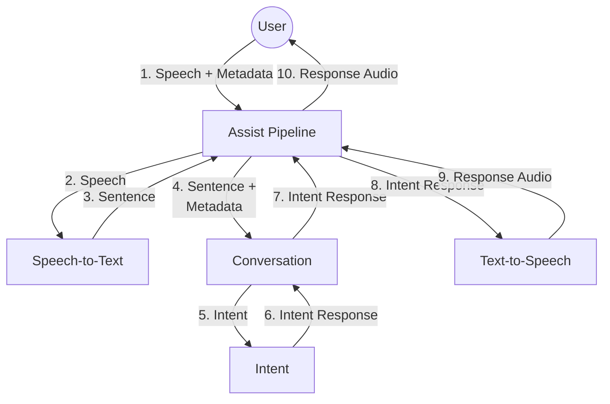

Building a voice assistant is a complex task. It requires a lot of different technologies to work together. This page will give you an overview of the different parts inside Home Assistant and how they will work together.

 - The **Assist Pipeline** integration is responsible for turning the user's speech into text, get it processed, and turn the response into speech.
 - The **Conversation** integration is responsible for processing user's text. The built-in conversation agent does this by matching it to an intent. Integrations can provide [custom conversation agents](../core/conversation/custom_agent).
 - The **Intent** integration is responsible for executing the intent and returning a response.
- The **Text-to-Speech** integration is responsible for turning text into speech.
- The **Speech-to-Text** integration is responsible for turning speech into text.

## Capturing the user's speech

The thing that the above diagram does not describe is how the user's speech is captured. There will be many ways to do this.

The ultimate goal is to make **Voice Satellites**. These are devices that can be placed anywhere in the house. Once it detects the hot word, it will capture the user's speech, send it to Home Assistant, and play the response back to the user.
